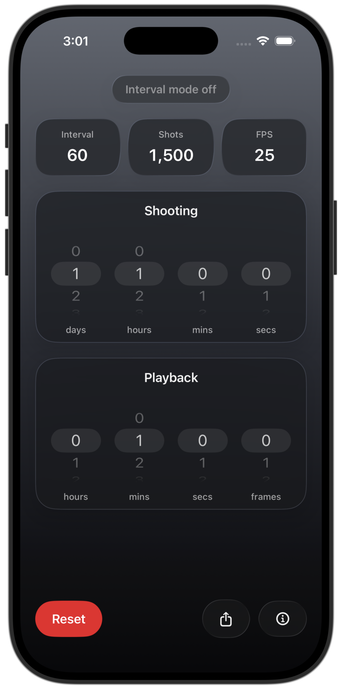
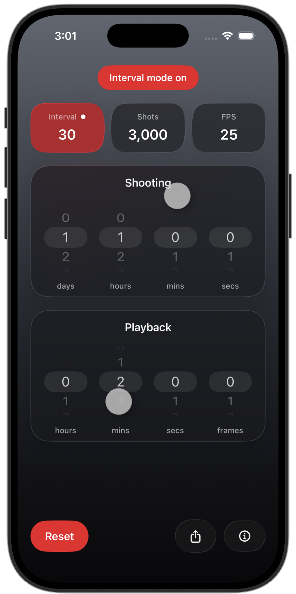
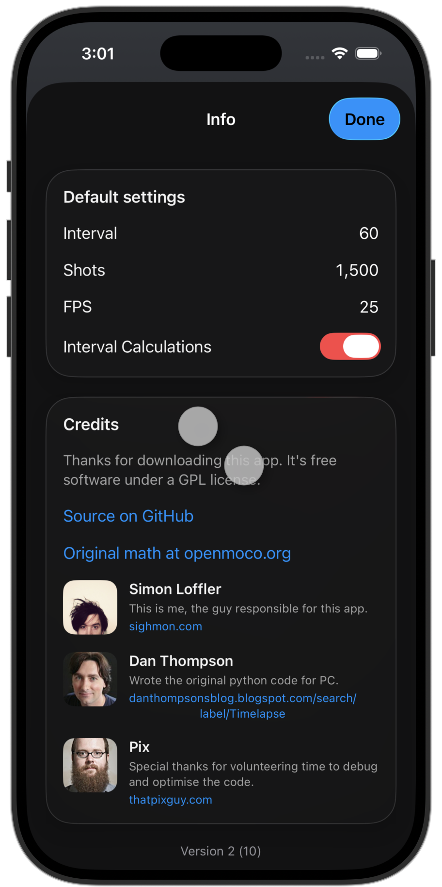

# Timelapse Helper for iOS

[Website](https://sighmon.com/timelapse-helper)

Requires iOS 17 or later. Uses Liquid Glass on iOS 26 and later, with material backgrounds on earlier versions.

## What's New?

Version 2.0

* Ported to SwiftUI
* Updated for iOS 27
* Added clicks and pops to the interface

Version 1.3

* Updated for iOS 8.
* Added iPhone 6 and iPhone 6+ support.
* Changed to Autolayout to handle the size differences.

Version 1.2

* Fixed a bug in 'Interval Calculator' mode where the interval wasn't being calculated when toggling the playback wheel.
* Updated for iOS 7.

Version 1.1

* Added Crashlytics to see if it's crashing for any of you.
http://crashlytics.com

Version 1.0

* Implemented 'Interval Calculator' mode toggle switch in the User Default Settings & info page. When turned 'on', the app will calculate the interval (in seconds) between photos to shoot a time-lapse of a desired length.
* To quickly switch between modes, double-tap the Interval label or the bottom bar.

Version 0.3

* Compatible with iPhone 5.

Version 0.2

* Beta feature: Double-tap the bottom bar to enter 'Interval calculator' mode.
* User-editable default settings on info screen.
* App settings added.

### Interval Calculator mode
This is a test feature I've added so you can calculate the Interval time (time in seconds between photos) by spinning the Shooting wheel. You'll notice that as you spin the wheel, the calculator automatically adjusts it to the closest shooting time available. This is because you can't select part seconds for the interval.
If you notice any strange things, or have any suggestions for improvements, please email me <sighmon(at)sighmon.com>

## Description
The Timelapse Helper iPhone app is a companion for anyone interested in timelapse photography.

It's a simple app to help you calculate the shooting time needed to create timelapse footage of a desired playback duration.

Set the interval time (in seconds) between photos, the frames per second that you'd like in the finished video and the app does the math for you.

There's even a little email button to send your calculations to your friends or camera crew.

Based on the original Python code for PC written by Dan Thompson, this iPhone app is FREE software released under a GPL license.

Written and designed by Simon Loffler.

Special thanks to Pix for his help with optimisation and bug fixes.

## Copyright
Copyright (c) 2011, Simon Loffler
All rights reserved.

## License
This software is made available under the terms of the simplified GPL license.
